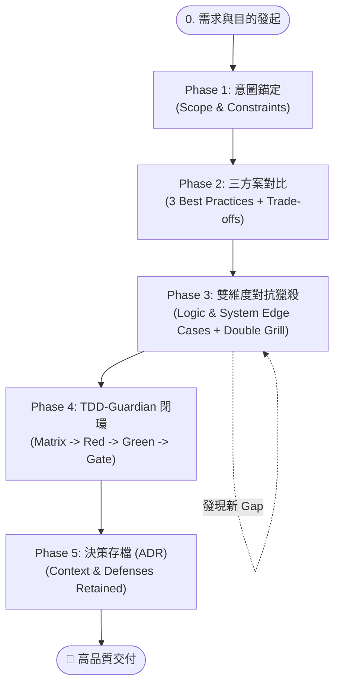

# 🚀 AI 結對編程黃金 SOP (Golden SOP Skill)

> **核心理念**：把 80% 的認知難度與潛在風險在前置階段消滅；用嚴格的對抗式審查（Grill）獵殺邊界；用 TDD 護欄確保無懈可擊的交付質量。

---

## 📦 快速安裝指南 (1 分鐘上手)

### 1. Google Antigravity / Gemini CLI 使用者
將 `golden-sop` 資料夾複製到全域 Skill 目錄即可：
```bash
# 建立目錄並複製
mkdir -p ~/.gemini/config/skills/golden-sop
cp SKILL.md ~/.gemini/config/skills/golden-sop/
```
或直接在專案根目錄啟用：
```bash
mkdir -p .agents/skills/golden-sop
cp SKILL.md .agents/skills/golden-sop/
```

---

### 2. Claude Code 使用者
將 `SKILL.md` 複製到 Claude 的 Skills 目錄：
```bash
mkdir -p ~/.claude/skills/golden-sop
cp SKILL.md ~/.claude/skills/golden-sop/
```

---

### 3. Cursor / Windsurf / ChatGPT / Claude Web 使用者
可直接將 `SKILL.md` 的內容貼到專案的 `.cursorrules`、`.windsurfrules`，或是直接作為 System Prompt / 自定義指令使用。

---

## 🧭 五階段全景工作流程 (5-Phase Architecture)



---

## 🔒 兩大核心硬性門禁 (The Two Gates)

1. **Phase 1 Gate（意圖錨定門禁）**：
   - AI 必須以「對話詢問」方式多維度收集需求與限制，並完成鏡像摘要。
   - **必須得到使用者明確許可（OK/確認）後，方可進入 Phase 2**。
2. **Phase 3 Gate（對抗獵殺門禁）**：
   - AI 必須依序執行 **Grill Yourself** ➔ **Grill Yourself Again** 進行二次深度拷問與多次邊緣 Gap 獵殺。
   - **必須得到使用者明確許可（OK/確認防禦完備）後，方可交由 TDD 進入 Phase 4 實作**。

---

## ⚡ 常用啟動 Prompt

```text
「我要實作 [功能名稱]，請依據五階段黃金 SOP 進行結對開發：
1. 先進行 Phase 1 意圖錨定提問；
2. 待我確認後給出 3 種最佳實踐 Trade-off 選型；
3. 選定後執行 Double Grill（Grill Yourself + Grill Yourself Again）；
4. 待我確認防禦完備後以 TDD 閉環實作；
5. 最後輸出 ADR 決策歸檔。」
```
