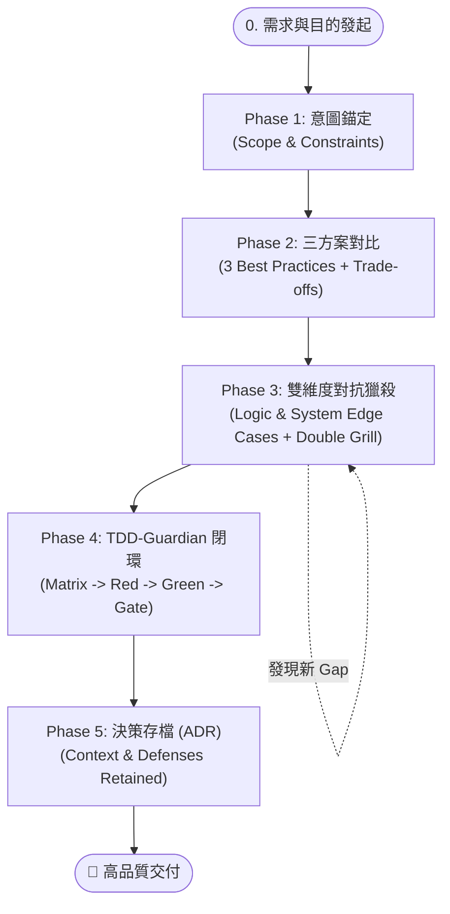

# 🚀 AI 結對編程黃金 SOP：選型、對抗獵殺、TDD 與決策閉環

> **核心理念**：把 80% 的認知難度與潛在風險在前置階段消滅；用嚴格的對抗式審查（Grill）獵殺邊界；用 TDD 護欄（TDD-Guardian）確保無懈可擊的交付質量。

---

## 🧭 五階段標準作業流程 (5-Phase SOP)

---

## 📋 階段執行規範與準則

### Phase 1：意圖錨定（Intent & Constraints Framing）
* **核心目標**：透過主動對話深度訪談，盡可能多收集訊息、徹底釐清「為什麼做」、「誰使用」、「核心輸入輸出」以及「不可妥協的約束」。
* **互動與執行規範**：
  1. **主動對話提問（Interactive Probing）**：
     - 不預設假設，採用蘇格拉底式引導提問，主動向使用者探詢業務場景、具體用例、邊界條件、輸入輸出結構、相依套件與限制。
     - 每次對話針對模糊點進行精準澄清，層層遞進收集上下文。
  2. **意圖理解鏡像（Understanding Mirroring）**：
     - 整理出一份清晰的「意圖與邊界摘要清單」（目的、範圍、環境限制、驗收關鍵指標）。
  3. **硬性進入門禁（Strict Confirmation Gate）**：
     - **鐵律**：必須主動詢問使用者「是否完全符合您的意圖？是否可進入 Phase 2 方案選型？」。
     - **未獲得使用者明確許可（如「OK」、「確認」、「可以進入下一階段」）前，嚴禁擅自推進到 Phase 2，更嚴禁直接撰寫實現代碼**。

---

### Phase 2：方案發散與 Trade-off 選型（3 Best Practices & Trade-offs）
* **核心目標**：跳脫單一思維定勢，探索業界 3 種主流解法並顯性化架構代價。
* **評估維度**：
  1. **複雜度 vs 維護性**（Codebase 認知負擔、閱讀門檻）
  2. **外部依賴性**（是否引入新套件、相依風險）
  3. **擴展彈性 vs YAGNI**（避免過度設計，切合當前需求）
* **輸出清單**：
  - 方案 A、B、C 核心思維與架構模式。
  - Trade-off 矩陣比較表。
  - AI 推薦方案與理由，等待使用者選定。

---

### Phase 3：雙維度對抗獵殺（Adversarial Edge-Case Hunting & Double Grill）
* **核心目標**：在動工寫代碼前，把所有極端狀況、系統併發、依賴故障全部攤在陽光下，透過多輪自我對抗徹底消滅架構盲點。
* **執行動作與標準流程**：
  1. **Round 1：Grill Yourself（第一輪自主對抗獵殺）**：
     - 全面施壓選定方案，針對兩大維度進行嚴格審查：
       - **維度 A（邏輯與數據邊界）**：空值/Null、數值溢出/邊界值、非法狀態機轉移、特殊 Unicode 與特殊字元。
       - **維度 B（系統與物理環境邊界）**：併發競態（Race Conditions）、網路逾時/重複請求、依賴服務故障、爆炸半徑（Blast Radius）、向後相容性。
  2. **Round 2：Grill Yourself Again（第二輪二次深度拷問）**：
     - 假定第一輪防禦已就緒，再次以極端刁鑽角度發起二次獵殺：複合型併發故障、網路抖動伴隨異常重試、記憶體與資源洩漏、優雅降級機制的崩潰點等。
  3. **多次迭代 Gap 尋找（Iterative Gap Hunting）**：
     - 多次反覆搜尋隱蔽的邊緣情況，輸出完整的「Edge Cases 清單」、「Gap 分析」與「具體防禦與降級策略」。
  4. **硬性進入門禁（Strict Confirmation Gate）**：
     - **鐵律**：彙整獵殺成果與防禦方案，主動提請使用者審核。**必須得到使用者明確許可（如「OK」、「確認防禦完備」、「進入 Phase 4」）後，方可交付 TDD-Guardian 進入 Phase 4 實作**。未獲許可前嚴禁進入測試編寫或代碼實作。

---

### Phase 4：TDD-Guardian 接手實作閉環（TDD Closed-Loop Execution）
* **核心目標**：以測試先行、嚴格斷言驅動實作，杜絕假綠燈與回歸。
* **標準節奏**：
  1. **Test Matrix 設計**：將 Phase 3 辨識出的邊界轉化為行為測試矩陣（S1~S6 等級）。
  2. **Red（紅燈驗證）**：先寫失敗的測試，確認測試精確捕獲行為邊界。
  3. **Green（綠燈實現）**：編寫剛好能通過測試的最精簡生產級代碼。
  4. **Refactor（重構優化）**：清理架構，確保測試全綠。
  5. **Gate 驗收**：執行覆蓋率與變異測試（Mutation Testing），確保斷言硬度。

---

### Phase 5：決策沉澱與知識歸檔（ADR Snapshot）
* **核心目標**：記錄本次架構決策與邊界防禦背景，防止未來重構踩坑。
* **ADR 結構**：
  - **Context（背景）**：為什麼做？
  - **Decision（決策）**：選擇了哪個方案？放棄了哪些？
  - **Edge Cases & Defenses（邊界防禦）**：防範了哪些關鍵異常？防禦代碼位置？
  - **Consequences（後續影響）**：好處與潛在限制。

---

## 🛡️ 避坑防線（Anti-Patterns）

1. ❌ **跳過 Trade-off 直接給代碼**：易陷入過度設計或脆弱解法。
2. ❌ **只測 Happy Path 與簡單 Null**：忽視併發競態與網路中斷。
3. ❌ **只看 Coverage 不看斷言強度**：嚴防無實質 assert 的假綠燈。
4. ❌ **未記錄防禦用意**：避免未來誤將 Edge Case 防禦代碼當作冗餘刪除。
