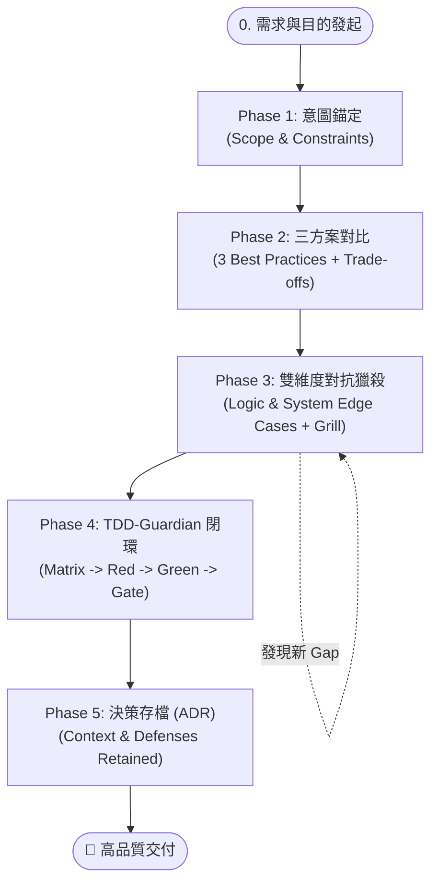

# 🚀 AI 結對編程黃金 SOP：選型、對抗獵殺、TDD 與決策閉環

> **核心理念**：把 80% 的認知難度與潛在風險在前置階段消滅；用嚴格的對抗式審查（Grill）獵殺邊界；用 TDD 護欄（TDD-Guardian）確保無懈可擊的交付質量。

---

## 🧭 全景工作流架構（Workflow Architecture）



---

## 📋 五階段實施手冊

### Phase 1：意圖錨定（Intent & Constraints Framing）
* **目標**：明確「為什麼做」、「誰使用」、「核心輸入輸出」以及「不可妥協的約束」。
* **輸入清單**：
  1. **商業/功能目的**：解決什麼問題？
  2. **環境與上下文**：現有語言、框架版本、核心相依套件。
  3. **限制條件**：效能要求、網路限制、安全性規範等。
* 💬 **推薦 Prompt 範本**：
  > 「阿吉，我要實作 [功能名稱]。  
  > **目的**：[解決的問題/達成的效果]  
  > **現有環境/約束**：[語言/框架/庫限制]  
  > 請先確認是否完全理解需求，暫時不要寫任何代碼。」

---

### Phase 2：方案發散與 Trade-off 選型（Option Exploration）
* **目標**：避免單一思維定勢，探索業界 3 種主流/最佳實踐解法並顯性化「代價」。
* **評估三維度**：
  1. **複雜度 vs 維護性**（Codebase 負擔、閱讀理解門檻）
  2. **外部依賴性**（是否引入新套件、相依風險）
  3. **擴展彈性 vs 當前 YAGNI**（避免過度設計，符合當前需求）
* 💬 **推薦 Prompt 範本**：
  > 「針對上述需求，請提供 **3 個業界主流的最佳實踐架構方案**。  
  > 每個方案請列出：  
  > 1. 核心實作思路與架構模式  
  > 2. 優缺點評估  
  > 3. Trade-off 矩陣（複雜度、依賴性、擴展性）  
  > 並標註你最推薦哪一個與具體理由。」

---

### Phase 3：雙維度對抗獵殺（Adversarial Edge-Case Hunting & Grill）
* **目標**：在動工寫代碼前，把所有可能踩坑的極端狀況、系統併發、依賴故障全部攤在陽光下。
* **雙維度邊界檢驗清單**：

| 維度 | 檢查項目 | 典型案例 |
| :--- | :--- | :--- |
| **A. 邏輯與數據邊界** | • 邊界數值 / 空值 / Null<br>• 型別異常與溢出<br>• 狀態機非法轉移<br>• 異常格式 / Unicode / 特殊符號 | 陣列長度為 0、極長字串、浮點數精度損失、未初始化物件 |
| **B. 系統與物理環境邊界** | • 併發與競態 (Race Conditions)<br>• 網路中斷 / 逾時 / 重複請求<br>• 外部相依服務掛掉<br>• 爆炸半徑 (Blast Radius)<br>• 向後相容性 (Backward Compatibility) | 快速重複點擊觸發兩次扣款、第三方 API 逾時、舊版本資料讀取 crash |

* 💬 **推薦 Prompt 範本**：
  > 「我選定 **[方案 X]**。現在請啟動 **Grill 對抗模式**：  
  > 1. 列出類似程序中最常踩到的 **維度 A（數據與邏輯邊界）** 與 **維度 B（系統併發、網路重試、爆炸半徑與相容性）** 的所有 Edge Cases。  
  > 2. 對這個方案進行壓力測試（Grill），指出架構可能崩潰的漏洞。  
  > 3. 補充 Gap 分析，提出具體的防禦策略與優雅降級方案。」

---

### Phase 4：TDD-Guardian 接手實作閉環（TDD Closed-Loop Execution）
* **目標**：以測試先行、嚴格斷言驅動實作，杜絕假綠燈與退化。
* **標準子流程**：
  1. **Test Matrix 設計**：將所有辨識出的 Edge Cases 轉為具體的測試用例（S1~S6 規範等級）。
  2. **Red（紅燈）**：撰寫失敗的測試，確認測試確實能抓住問題。
  3. **Green（綠燈）**：撰寫剛好能通過測試的最精簡實作。
  4. **Refactor（重構）**：清理架構，保持測試綠燈。
  5. **Gate 驗收**：執行覆蓋率與變異測試（Mutation Testing），確保斷言硬度。
* 💬 **推薦 Prompt 範本**：
  > 「請將剛才討論出的所有 Edge Cases 與防禦規格整合，交由 `tdd-guardian` 執行：  
  > 1. 生成行為導向的 Test Matrix（包含成功、失敗、極端邊界與降級案例）。  
  > 2. 嚴格遵循 Red -> Green -> Refactor 節奏進行實作。  
  > 3. 完成後執行覆蓋率與斷言驗證。」

---

### Phase 5：決策沉澱與知識歸檔（ADR Snapshot）
* **目標**：將本次的架構決策與邊界防禦背景記錄下來，避免未來重構時踩坑。
* **ADR 四要素**：
  * **Context（背景）**：為什麼要實作這個模組？
  * **Decision（決策）**：選擇了哪個方案？放棄了哪些方案？
  * **Edge Cases & Defenses（邊界防禦）**：防範了哪些關鍵異常？防禦代碼的位置？
  * **Consequences（後續影響）**：帶來的好處與潛在限制。
* 💬 **推薦 Prompt 範本**：
  > 「開發已完成。請輸出簡潔的 **ADR（架構決策記錄）** 摘要，包含選型原因、防禦的關鍵 Edge Cases 與維護備忘。」

---

## ⚡ 一鍵啟動指令卡（Cheat Sheet）

```markdown
【啟動任務】：
「阿吉，需求：[XXX]，目的：[YYY]。
請按五步 SOP 進行：
Step 1: 給出 3 個業界最佳實踐架構 + Trade-off 對比表。
（待我選定後）
Step 2: 啟動雙維度 Grill（邏輯邊界 + 系統併發/爆炸半徑），輸出 Edge Cases 清單與防禦策略。
Step 3: 交付 tdd-guardian 建立 Test Matrix 並嚴格 Red-Green-Refactor 實作。
Step 4: 完成後輸出簡明 ADR 決策存檔。」
```

---

## 🛡️ 避坑防線（Anti-Patterns）

1. ❌ **跳過 Trade-off 直接給代碼**：容易陷入過度設計（Over-engineering）或選了過於脆弱的方案。
2. ❌ **只測 Happy Path 與簡單 Null**：忽視網路中斷、重複請求與併發競態，上線必踩雷。
3. ❌ **只看 Code Coverage 不看斷言強度**：100% 覆蓋率可能沒有任何有意義的 `assert`，必須透過變異思維（Mutation）檢驗測試真確性。
4. ❌ **沒有記錄邊界處理的用意**：過幾個月重構時，常把「專門防禦特殊 edge case」的代碼當作贅詞刪掉，造成 Regression。
